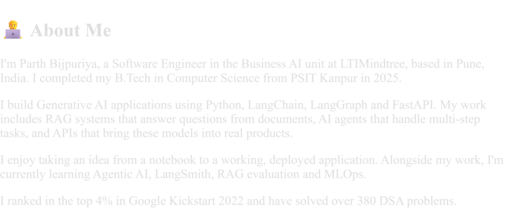

  
  
  

---

## 🌟 Featured Projects

<table>
<tr>
<td width="50%" valign="top">

### 🧠 [NeuroSpeech](https://github.com/parth656/neurospeech)
AI speech-practice app for **cluttering and articulation**. Whisper transcription, IPA phonetics, word-by-word feedback, speech-rate and pause analysis, plus progress tracking.

`Python` `Whisper` `Streamlit` `FFmpeg` `SQLite` `Docker`

[▶ Live Demo](https://huggingface.co/spaces/parthbijpuriya/neurospeech)

</td>
<td width="50%" valign="top">

### ✈️ [QuanTrip AI](https://github.com/parth656/QuanTrip)
AI travel planner that turns a trip request into a structured itinerary using LLMs.

`Python` `LLMs` `LangChain` `FastAPI`

</td>
</tr>
<tr>
<td width="50%" valign="top">

### 📚 LTM-RAG
End-to-end **RAG pipeline**: document loaders → chunking → HuggingFace embeddings → ChromaDB → Gemini answers.

`LangChain` `ChromaDB` `HuggingFace` `Gemini`

</td>
<td width="50%" valign="top">

### 🤖 RAGHAVA Bot
Chatbot with **hybrid retrieval** (keyword + vector search) and an agent workflow on top of Gemini.

`Flask` `Gemini` `Hybrid Search` `Agents`

</td>
</tr>
<tr>
<td width="50%" valign="top">

### 🎤 SpeechFix
**Offline** speech-correction tool using phoneme recognition.

`wav2vec2` `Allosaurus` `espeak-ng` `PyTorch`

</td>
<td width="50%" valign="top">

### 😊 Emotion Detection
Real-time facial emotion recognition from webcam video.

`OpenCV` `Deep Learning` `Python`

</td>
</tr>
</table>

---

## 🛠️ Tech Stack

  
    
  

  
  
  
  
  
  
  
  

---

## 📊 GitHub Stats

  
  

  

  

---

## 🎯 Current Focus & Goals

| 🔭 Working on | 🚀 Goals |
|---|---|
| Agentic AI with LangGraph | Ship production-ready AI systems |
| RAG evaluation & LangSmith tracing | Contribute to open source |
| Real-time Speech AI (Whisper + FastAPI) | Publish research-quality AI projects |
| Fine-tuning LLMs & MLOps | Improve accessibility through Speech AI |

---

## 📫 Connect

  
  

⭐ **If you find my work useful, consider starring a repository!**

